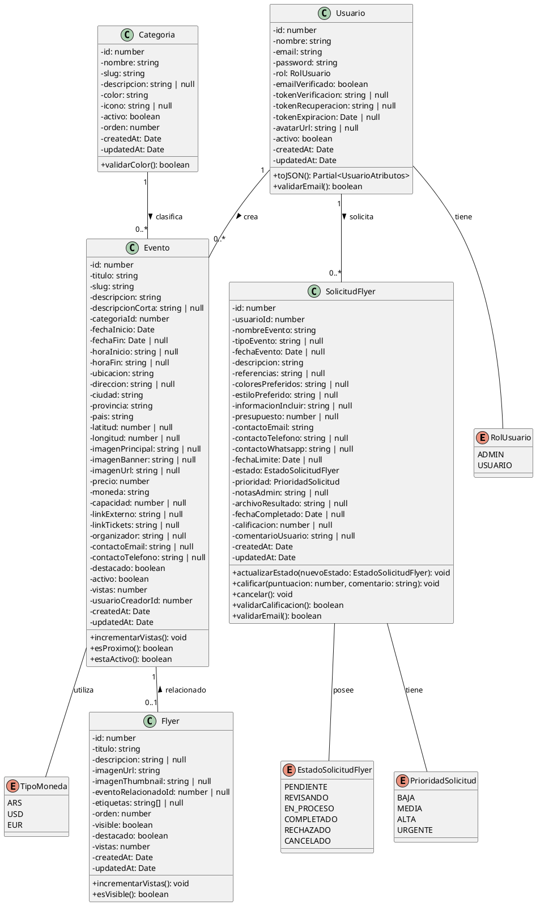

# Diagrama de Clases - Agenda Cultural

## Descripción General
Este diagrama representa las principales entidades del sistema de Agenda Cultural, siguiendo los principios de la Programación Orientada a Objetos (POO) y el patrón MVC implementado con TypeScript y Sequelize ORM.

---

## Diagrama UML



---

## Descripción de Clases Principales

### 1. Usuario
**Propósito**: Representa a los usuarios del sistema (administradores y usuarios regulares).

**Atributos principales**:
- `id`: Identificador único del usuario
- `nombre`: Nombre completo del usuario
- `email`: Correo electrónico único
- `password`: Contraseña encriptada
- `rol`: Tipo de usuario (ADMIN o USUARIO)
- `emailVerificado`: Estado de verificación del correo
- `activo`: Estado de activación de la cuenta

**Métodos principales**:
- `toJSON()`: Serializa el objeto eliminando datos sensibles (password, tokens)
- `validarEmail()`: Verifica que el formato del email sea válido

**Relaciones**:
- Crea múltiples Eventos (1:N)
- Realiza múltiples SolicitudesFlyer (1:N)

---

### 2. Categoria
**Propósito**: Clasificación de eventos culturales (música, teatro, cine, etc.).

**Atributos principales**:
- `id`: Identificador único
- `nombre`: Nombre de la categoría
- `slug`: URL amigable única
- `color`: Color hexadecimal para identificación visual
- `icono`: Nombre del icono asociado
- `activo`: Estado de la categoría
- `orden`: Orden de visualización

**Métodos principales**:
- `validarColor()`: Valida que el color esté en formato hexadecimal válido

**Relaciones**:
- Clasifica múltiples Eventos (1:N)

---

### 3. Evento
**Propósito**: Representa eventos culturales publicados en la plataforma.

**Atributos principales**:
- `id`: Identificador único
- `titulo`: Nombre del evento
- `slug`: URL amigable única
- `descripcion`: Descripción detallada del evento
- `categoriaId`: Referencia a la categoría
- `fechaInicio`, `fechaFin`: Fechas del evento
- `ubicacion`: Nombre del lugar
- `precio`: Costo de entrada
- `destacado`: Marca si el evento es destacado
- `vistas`: Contador de visualizaciones
- `usuarioCreadorId`: Usuario que creó el evento

**Métodos principales**:
- `incrementarVistas()`: Aumenta el contador de visualizaciones
- `esProximo()`: Verifica si el evento es próximo a realizarse
- `estaActivo()`: Comprueba si el evento está activo

**Relaciones**:
- Pertenece a una Categoria (N:1)
- Creado por un Usuario (N:1)
- Puede tener un Flyer relacionado (1:0..1)

---

### 4. Flyer
**Propósito**: Imágenes promocionales de eventos culturales.

**Atributos principales**:
- `id`: Identificador único
- `titulo`: Título del flyer
- `imagenUrl`: URL de la imagen principal
- `imagenThumbnail`: Miniatura de la imagen
- `eventoRelacionadoId`: Evento asociado (opcional)
- `etiquetas`: Array de etiquetas para categorización
- `visible`: Estado de visibilidad
- `destacado`: Marca si es destacado
- `vistas`: Contador de visualizaciones

**Métodos principales**:
- `incrementarVistas()`: Aumenta el contador de visualizaciones
- `esVisible()`: Verifica si el flyer es visible públicamente

**Relaciones**:
- Puede estar relacionado con un Evento (N:0..1)

---

### 5. SolicitudFlyer
**Propósito**: Gestiona las solicitudes de diseño de flyers realizadas por usuarios.

**Atributos principales**:
- `id`: Identificador único
- `usuarioId`: Usuario que realiza la solicitud
- `nombreEvento`: Nombre del evento para el flyer
- `descripcion`: Descripción de la solicitud
- `referencias`: Enlaces o referencias visuales
- `coloresPreferidos`: Preferencias de color
- `estado`: Estado actual de la solicitud
- `prioridad`: Nivel de prioridad
- `fechaCompletado`: Fecha de finalización
- `calificacion`: Puntuación del usuario (1-5)

**Métodos principales**:
- `actualizarEstado()`: Cambia el estado de la solicitud
- `calificar()`: Permite al usuario calificar el trabajo
- `cancelar()`: Cancela la solicitud
- `validarCalificacion()`: Valida que la calificación esté entre 1 y 5

**Relaciones**:
- Pertenece a un Usuario (N:1)

---

## Enumeraciones

### RolUsuario
- `ADMIN`: Administrador del sistema
- `USUARIO`: Usuario regular

### EstadoSolicitudFlyer
- `PENDIENTE`: Solicitud recibida, pendiente de revisión
- `REVISANDO`: En proceso de revisión
- `EN_PROCESO`: Diseño en desarrollo
- `COMPLETADO`: Finalizado exitosamente
- `RECHAZADO`: Solicitud rechazada
- `CANCELADO`: Cancelado por el usuario

### PrioridadSolicitud
- `BAJA`: Prioridad baja
- `MEDIA`: Prioridad media (por defecto)
- `ALTA`: Prioridad alta
- `URGENTE`: Requiere atención inmediata

### TipoMoneda
- `ARS`: Peso argentino
- `USD`: Dólar estadounidense
- `EUR`: Euro

---

## Notas de Implementación

1. **ORM Utilizado**: Sequelize con TypeScript
2. **Patrón de Diseño**: MVC (Model-View-Controller)
3. **Base de Datos**: Relacional (compatible con PostgreSQL, MySQL, SQLite)
4. **Validaciones**: Implementadas a nivel de modelo y controlador
5. **Seguridad**:
   - Contraseñas encriptadas con bcrypt
   - Tokens de verificación y recuperación
   - Serialización segura eliminando datos sensibles

6. **Índices de Base de Datos**:
   - Índices en campos de búsqueda frecuente (email, slug, estado)
   - Índices en claves foráneas para optimizar joins
   - Índices en campos de filtrado (activo, destacado, fecha)

---

## Diagrama Simplificado de Relaciones

```
Usuario (1) ──── crea ────> (N) Evento
   │                            │
   │                            │
   │                            │ pertenece a
   │                            │
   │                            ↓
   │                        Categoria (1)
   │
   │
   └──── solicita ────> (N) SolicitudFlyer


Evento (1) ←── relacionado con ─── (0..1) Flyer
```

---

**Versión**: 1.0
**Fecha**: 2025-11-14
**Tecnología**: TypeScript + Sequelize ORM
