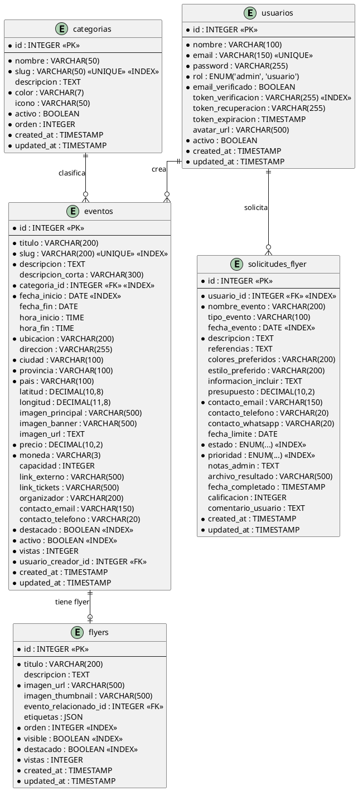

# Diagrama Entidad-Relación - Agenda Cultural

## Descripción General
Este documento presenta el modelo lógico de la base de datos del sistema de Agenda Cultural, describiendo las entidades, sus atributos, tipos de datos, restricciones y relaciones. El modelo está normalizado siguiendo la Tercera Forma Normal (3FN) para garantizar integridad y evitar redundancia de datos.

---

## Diagrama ER Completo



---

## Descripción Detallada de Entidades

### 1. usuarios

**Descripción**: Almacena la información de los usuarios del sistema (administradores y usuarios regulares).

**Atributos**:

| Campo | Tipo | Restricciones | Descripción |
|-------|------|---------------|-------------|
| id | INTEGER | PK, AUTO_INCREMENT | Identificador único del usuario |
| nombre | VARCHAR(100) | NOT NULL | Nombre completo del usuario |
| email | VARCHAR(150) | NOT NULL, UNIQUE | Correo electrónico único |
| password | VARCHAR(255) | NOT NULL | Contraseña encriptada con bcrypt |
| rol | ENUM | NOT NULL, DEFAULT 'usuario' | Rol del usuario (admin, usuario) |
| email_verificado | BOOLEAN | NOT NULL, DEFAULT false | Indica si el email está verificado |
| token_verificacion | VARCHAR(255) | NULL | Token para verificación de email |
| token_recuperacion | VARCHAR(255) | NULL | Token para recuperación de contraseña |
| token_expiracion | TIMESTAMP | NULL | Fecha de expiración del token |
| avatar_url | VARCHAR(500) | NULL | URL del avatar del usuario |
| activo | BOOLEAN | NOT NULL, DEFAULT true | Estado de la cuenta |
| created_at | TIMESTAMP | NOT NULL | Fecha de creación |
| updated_at | TIMESTAMP | NOT NULL | Fecha de última actualización |

**Índices**:
- PRIMARY KEY (id)
- UNIQUE INDEX (email)
- INDEX idx_email (email)
- INDEX idx_token_verificacion (token_verificacion)

**Validaciones**:
- email: Formato de email válido
- password: Mínimo 6 caracteres antes de encriptar
- rol: Solo valores 'admin' o 'usuario'

---

### 2. categorias

**Descripción**: Categorías para clasificar eventos culturales (música, teatro, cine, etc.).

**Atributos**:

| Campo | Tipo | Restricciones | Descripción |
|-------|------|---------------|-------------|
| id | INTEGER | PK, AUTO_INCREMENT | Identificador único |
| nombre | VARCHAR(50) | NOT NULL | Nombre de la categoría |
| slug | VARCHAR(50) | NOT NULL, UNIQUE | URL amigable única |
| descripcion | TEXT | NULL | Descripción de la categoría |
| color | VARCHAR(7) | NOT NULL, DEFAULT '#FF0000' | Color hexadecimal para UI |
| icono | VARCHAR(50) | NULL | Nombre del icono (ej: 'music', 'theater') |
| activo | BOOLEAN | NOT NULL, DEFAULT true | Estado de la categoría |
| orden | INTEGER | NOT NULL, DEFAULT 0 | Orden de visualización |
| created_at | TIMESTAMP | NOT NULL | Fecha de creación |
| updated_at | TIMESTAMP | NOT NULL | Fecha de última actualización |

**Índices**:
- PRIMARY KEY (id)
- UNIQUE INDEX (slug)
- INDEX idx_slug (slug)
- INDEX idx_activo (activo)

**Validaciones**:
- color: Formato hexadecimal #RRGGBB
- slug: Generado automáticamente desde nombre

---

### 3. eventos

**Descripción**: Eventos culturales publicados en la plataforma.

**Atributos**:

| Campo | Tipo | Restricciones | Descripción |
|-------|------|---------------|-------------|
| id | INTEGER | PK, AUTO_INCREMENT | Identificador único |
| titulo | VARCHAR(200) | NOT NULL | Título del evento |
| slug | VARCHAR(200) | NOT NULL, UNIQUE | URL amigable única |
| descripcion | TEXT | NOT NULL | Descripción completa del evento |
| descripcion_corta | VARCHAR(300) | NULL | Resumen breve |
| categoria_id | INTEGER | NOT NULL, FK → categorias(id) | Categoría del evento |
| fecha_inicio | DATE | NOT NULL | Fecha de inicio |
| fecha_fin | DATE | NULL | Fecha de finalización |
| hora_inicio | TIME | NULL | Hora de inicio |
| hora_fin | TIME | NULL | Hora de finalización |
| ubicacion | VARCHAR(200) | NOT NULL | Nombre del lugar |
| direccion | VARCHAR(255) | NULL | Dirección completa |
| ciudad | VARCHAR(100) | NOT NULL, DEFAULT 'Venado Tuerto' | Ciudad |
| provincia | VARCHAR(100) | NOT NULL, DEFAULT 'Santa Fe' | Provincia/Estado |
| pais | VARCHAR(100) | NOT NULL, DEFAULT 'Argentina' | País |
| latitud | DECIMAL(10,8) | NULL | Latitud para mapa |
| longitud | DECIMAL(11,8) | NULL | Longitud para mapa |
| imagen_principal | VARCHAR(500) | NULL | URL imagen principal |
| imagen_banner | VARCHAR(500) | NULL | URL imagen banner |
| imagen_url | TEXT | NULL | URL imagen adicional |
| precio | DECIMAL(10,2) | NOT NULL, DEFAULT 0 | Precio de entrada |
| moneda | VARCHAR(3) | NOT NULL, DEFAULT 'ARS' | Código de moneda (ISO 4217) |
| capacidad | INTEGER | NULL | Capacidad máxima |
| link_externo | VARCHAR(500) | NULL | Link a sitio externo |
| link_tickets | VARCHAR(500) | NULL | Link para comprar tickets |
| organizador | VARCHAR(200) | NULL | Nombre del organizador |
| contacto_email | VARCHAR(150) | NULL | Email de contacto |
| contacto_telefono | VARCHAR(20) | NULL | Teléfono de contacto |
| destacado | BOOLEAN | NOT NULL, DEFAULT false | Marcar como destacado |
| activo | BOOLEAN | NOT NULL, DEFAULT true | Estado del evento |
| vistas | INTEGER | NOT NULL, DEFAULT 0 | Contador de visualizaciones |
| usuario_creador_id | INTEGER | NOT NULL, FK → usuarios(id) | Usuario que creó el evento |
| created_at | TIMESTAMP | NOT NULL | Fecha de creación |
| updated_at | TIMESTAMP | NOT NULL | Fecha de última actualización |

**Índices**:
- PRIMARY KEY (id)
- UNIQUE INDEX (slug)
- INDEX idx_slug (slug)
- INDEX idx_categoria (categoria_id)
- INDEX idx_fecha_inicio (fecha_inicio)
- INDEX idx_destacado (destacado)
- INDEX idx_activo (activo)
- FOREIGN KEY (categoria_id) REFERENCES categorias(id)
- FOREIGN KEY (usuario_creador_id) REFERENCES usuarios(id)

**Validaciones**:
- titulo: Mínimo 3 caracteres
- descripcion: Mínimo 10 caracteres
- precio: Mayor o igual a 0
- contacto_email: Formato de email válido
- latitud: Entre -90 y 90
- longitud: Entre -180 y 180

---

### 4. flyers

**Descripción**: Imágenes promocionales (flyers) de eventos culturales.

**Atributos**:

| Campo | Tipo | Restricciones | Descripción |
|-------|------|---------------|-------------|
| id | INTEGER | PK, AUTO_INCREMENT | Identificador único |
| titulo | VARCHAR(200) | NOT NULL | Título del flyer |
| descripcion | TEXT | NULL | Descripción |
| imagen_url | VARCHAR(500) | NOT NULL | URL de la imagen principal |
| imagen_thumbnail | VARCHAR(500) | NULL | URL de la miniatura |
| evento_relacionado_id | INTEGER | NULL, FK → eventos(id) | Evento asociado (opcional) |
| etiquetas | JSON | NULL | Array de etiquetas ['música', 'rock'] |
| orden | INTEGER | NOT NULL, DEFAULT 0 | Orden de visualización |
| visible | BOOLEAN | NOT NULL, DEFAULT true | Visibilidad pública |
| destacado | BOOLEAN | NOT NULL, DEFAULT false | Marcar como destacado |
| vistas | INTEGER | NOT NULL, DEFAULT 0 | Contador de visualizaciones |
| created_at | TIMESTAMP | NOT NULL | Fecha de creación |
| updated_at | TIMESTAMP | NOT NULL | Fecha de última actualización |

**Índices**:
- PRIMARY KEY (id)
- INDEX idx_visible (visible)
- INDEX idx_destacado (destacado)
- INDEX idx_orden (orden)
- FOREIGN KEY (evento_relacionado_id) REFERENCES eventos(id) ON DELETE SET NULL

**Validaciones**:
- titulo: Mínimo 3 caracteres
- imagen_url: URL válida

---

### 5. solicitudes_flyer

**Descripción**: Solicitudes de diseño de flyers realizadas por usuarios.

**Atributos**:

| Campo | Tipo | Restricciones | Descripción |
|-------|------|---------------|-------------|
| id | INTEGER | PK, AUTO_INCREMENT | Identificador único |
| usuario_id | INTEGER | NOT NULL, FK → usuarios(id) | Usuario que solicita |
| nombre_evento | VARCHAR(200) | NOT NULL | Nombre del evento |
| tipo_evento | VARCHAR(100) | NULL | Tipo de evento |
| fecha_evento | DATE | NULL | Fecha del evento |
| descripcion | TEXT | NOT NULL | Descripción de la solicitud |
| referencias | TEXT | NULL | Referencias visuales o links |
| colores_preferidos | VARCHAR(200) | NULL | Colores deseados |
| estilo_preferido | VARCHAR(200) | NULL | Estilo visual deseado |
| informacion_incluir | TEXT | NULL | Información a incluir en el diseño |
| presupuesto | DECIMAL(10,2) | NULL | Presupuesto disponible |
| contacto_email | VARCHAR(150) | NOT NULL | Email de contacto |
| contacto_telefono | VARCHAR(20) | NULL | Teléfono de contacto |
| contacto_whatsapp | VARCHAR(20) | NULL | WhatsApp de contacto |
| fecha_limite | DATE | NULL | Fecha límite de entrega |
| estado | ENUM | NOT NULL, DEFAULT 'pendiente' | Estado de la solicitud |
| prioridad | ENUM | NOT NULL, DEFAULT 'media' | Prioridad de la solicitud |
| notas_admin | TEXT | NULL | Notas internas del administrador |
| archivo_resultado | VARCHAR(500) | NULL | URL del diseño final |
| fecha_completado | TIMESTAMP | NULL | Fecha de completado |
| calificacion | INTEGER | NULL | Calificación del usuario (1-5) |
| comentario_usuario | TEXT | NULL | Comentario de calificación |
| created_at | TIMESTAMP | NOT NULL | Fecha de creación |
| updated_at | TIMESTAMP | NOT NULL | Fecha de última actualización |

**Índices**:
- PRIMARY KEY (id)
- INDEX idx_usuario (usuario_id)
- INDEX idx_estado (estado)
- INDEX idx_prioridad (prioridad)
- INDEX idx_fecha_evento (fecha_evento)
- FOREIGN KEY (usuario_id) REFERENCES usuarios(id)

**Validaciones**:
- contacto_email: Formato de email válido
- calificacion: Entre 1 y 5 (si no es NULL)
- estado: Valores válidos del enum
- prioridad: Valores válidos del enum

**Valores ENUM**:
- **estado**: 'pendiente', 'revisando', 'en_proceso', 'completado', 'rechazado', 'cancelado'
- **prioridad**: 'baja', 'media', 'alta', 'urgente'

---

## Relaciones y Cardinalidad

### Relación: usuarios → eventos
- **Tipo**: Uno a Muchos (1:N)
- **Descripción**: Un usuario puede crear múltiples eventos
- **Clave Foránea**: eventos.usuario_creador_id → usuarios.id
- **Restricciones**:
  - ON DELETE: RESTRICT (no se puede eliminar usuario con eventos)
  - ON UPDATE: CASCADE

### Relación: usuarios → solicitudes_flyer
- **Tipo**: Uno a Muchos (1:N)
- **Descripción**: Un usuario puede realizar múltiples solicitudes
- **Clave Foránea**: solicitudes_flyer.usuario_id → usuarios.id
- **Restricciones**:
  - ON DELETE: RESTRICT (no se puede eliminar usuario con solicitudes)
  - ON UPDATE: CASCADE

### Relación: categorias → eventos
- **Tipo**: Uno a Muchos (1:N)
- **Descripción**: Una categoría clasifica múltiples eventos
- **Clave Foránea**: eventos.categoria_id → categorias.id
- **Restricciones**:
  - ON DELETE: RESTRICT (no se puede eliminar categoría con eventos)
  - ON UPDATE: CASCADE

### Relación: eventos → flyers
- **Tipo**: Uno a Uno Opcional (1:0..1)
- **Descripción**: Un evento puede tener un flyer relacionado (opcional)
- **Clave Foránea**: flyers.evento_relacionado_id → eventos.id
- **Restricciones**:
  - ON DELETE: SET NULL (si se elimina el evento, el flyer no se elimina)
  - ON UPDATE: CASCADE

---

## Reglas de Integridad

### Integridad de Entidad
- Todas las tablas tienen clave primaria (id) auto-incremental
- No se permiten valores NULL en claves primarias

### Integridad Referencial
- Todas las claves foráneas referencian claves primarias válidas
- Se aplica CASCADE en actualizaciones
- Se aplica RESTRICT en eliminaciones para preservar datos históricos
- Excepción: flyers.evento_relacionado_id permite SET NULL

### Integridad de Dominio
- Todos los campos tienen tipos de datos apropiados
- Los campos ENUM están restringidos a valores predefinidos
- Los campos BOOLEAN solo aceptan true/false
- Los campos DECIMAL tienen precisión definida
- Los VARCHAR tienen longitud máxima definida

### Reglas de Negocio
1. **Usuarios**:
   - El email debe ser único en todo el sistema
   - La contraseña debe almacenarse encriptada
   - Solo puede haber rol 'admin' o 'usuario'

2. **Eventos**:
   - El slug debe ser único y generado automáticamente
   - La fecha_inicio no puede ser menor que la fecha_fin
   - El precio no puede ser negativo
   - Un evento solo puede ser editado por su creador o un admin

3. **Categorías**:
   - El slug debe ser único
   - El color debe estar en formato hexadecimal
   - No se puede eliminar una categoría con eventos asociados

4. **Flyers**:
   - Si hay evento_relacionado_id, debe existir el evento
   - El orden define la secuencia de visualización en galería

5. **Solicitudes**:
   - Una vez completada o rechazada, no se puede cambiar el estado
   - La calificación solo se puede dar en estado COMPLETADO
   - Solo el usuario propietario puede cancelar su solicitud

---

## Normalización

### Primera Forma Normal (1FN)
- Todos los atributos son atómicos
- No hay grupos repetitivos
- Cada campo contiene un solo valor
- Excepción: etiquetas en flyers usa JSON para arrays (permitido en bases modernas)

### Segunda Forma Normal (2FN)
- Cumple 1FN
- Todos los atributos no clave dependen completamente de la clave primaria
- No hay dependencias parciales

### Tercera Forma Normal (3FN)
- Cumple 2FN
- No existen dependencias transitivas
- Todos los atributos no clave dependen solo de la clave primaria
- Ejemplo: categorias está separada de eventos para evitar redundancia

---

## Estimación de Volumen de Datos

| Tabla | Crecimiento | Tamaño Estimado (1 año) |
|-------|-------------|-------------------------|
| usuarios | 100/mes | 1,200 registros |
| categorias | 1-2/año | 15-20 registros |
| eventos | 50/mes | 600 registros |
| flyers | 30/mes | 360 registros |
| solicitudes_flyer | 20/mes | 240 registros |

---

## Consideraciones de Rendimiento

### Índices Optimizados
- Índices en campos de búsqueda frecuente (email, slug)
- Índices en claves foráneas para acelerar joins
- Índices compuestos donde sea necesario (activo + destacado)

### Estrategias de Optimización
1. **Paginación**: Implementada en consultas de listados
2. **Eager Loading**: Cargar relaciones frecuentes en una sola query
3. **Caching**: Categorías y datos estáticos en cache
4. **Soft Delete**: Eventos y usuarios se marcan como inactivos en lugar de eliminarse
5. **Índices Selectivos**: Solo en campos que se consultan frecuentemente

### Mantenimiento
- VACUUM periódico en PostgreSQL
- ANALYZE para actualizar estadísticas
- Limpieza de tokens expirados mensualmente
- Archivado de eventos antiguos anualmente

---

## Scripts SQL de Creación

### Crear tabla usuarios
```sql
CREATE TABLE usuarios (
  id INTEGER PRIMARY KEY AUTO_INCREMENT,
  nombre VARCHAR(100) NOT NULL,
  email VARCHAR(150) NOT NULL UNIQUE,
  password VARCHAR(255) NOT NULL,
  rol ENUM('admin', 'usuario') NOT NULL DEFAULT 'usuario',
  email_verificado BOOLEAN NOT NULL DEFAULT false,
  token_verificacion VARCHAR(255),
  token_recuperacion VARCHAR(255),
  token_expiracion TIMESTAMP,
  avatar_url VARCHAR(500),
  activo BOOLEAN NOT NULL DEFAULT true,
  created_at TIMESTAMP NOT NULL DEFAULT CURRENT_TIMESTAMP,
  updated_at TIMESTAMP NOT NULL DEFAULT CURRENT_TIMESTAMP ON UPDATE CURRENT_TIMESTAMP,
  INDEX idx_email (email),
  INDEX idx_token_verificacion (token_verificacion)
);
```

### Crear tabla categorias
```sql
CREATE TABLE categorias (
  id INTEGER PRIMARY KEY AUTO_INCREMENT,
  nombre VARCHAR(50) NOT NULL,
  slug VARCHAR(50) NOT NULL UNIQUE,
  descripcion TEXT,
  color VARCHAR(7) NOT NULL DEFAULT '#FF0000',
  icono VARCHAR(50),
  activo BOOLEAN NOT NULL DEFAULT true,
  orden INTEGER NOT NULL DEFAULT 0,
  created_at TIMESTAMP NOT NULL DEFAULT CURRENT_TIMESTAMP,
  updated_at TIMESTAMP NOT NULL DEFAULT CURRENT_TIMESTAMP ON UPDATE CURRENT_TIMESTAMP,
  INDEX idx_slug (slug),
  INDEX idx_activo (activo)
);
```

### Crear tabla eventos
```sql
CREATE TABLE eventos (
  id INTEGER PRIMARY KEY AUTO_INCREMENT,
  titulo VARCHAR(200) NOT NULL,
  slug VARCHAR(200) NOT NULL UNIQUE,
  descripcion TEXT NOT NULL,
  descripcion_corta VARCHAR(300),
  categoria_id INTEGER NOT NULL,
  fecha_inicio DATE NOT NULL,
  fecha_fin DATE,
  hora_inicio TIME,
  hora_fin TIME,
  ubicacion VARCHAR(200) NOT NULL,
  direccion VARCHAR(255),
  ciudad VARCHAR(100) NOT NULL DEFAULT 'Venado Tuerto',
  provincia VARCHAR(100) NOT NULL DEFAULT 'Santa Fe',
  pais VARCHAR(100) NOT NULL DEFAULT 'Argentina',
  latitud DECIMAL(10,8),
  longitud DECIMAL(11,8),
  imagen_principal VARCHAR(500),
  imagen_banner VARCHAR(500),
  imagen_url TEXT,
  precio DECIMAL(10,2) NOT NULL DEFAULT 0,
  moneda VARCHAR(3) NOT NULL DEFAULT 'ARS',
  capacidad INTEGER,
  link_externo VARCHAR(500),
  link_tickets VARCHAR(500),
  organizador VARCHAR(200),
  contacto_email VARCHAR(150),
  contacto_telefono VARCHAR(20),
  destacado BOOLEAN NOT NULL DEFAULT false,
  activo BOOLEAN NOT NULL DEFAULT true,
  vistas INTEGER NOT NULL DEFAULT 0,
  usuario_creador_id INTEGER NOT NULL,
  created_at TIMESTAMP NOT NULL DEFAULT CURRENT_TIMESTAMP,
  updated_at TIMESTAMP NOT NULL DEFAULT CURRENT_TIMESTAMP ON UPDATE CURRENT_TIMESTAMP,
  INDEX idx_slug (slug),
  INDEX idx_categoria (categoria_id),
  INDEX idx_fecha_inicio (fecha_inicio),
  INDEX idx_destacado (destacado),
  INDEX idx_activo (activo),
  FOREIGN KEY (categoria_id) REFERENCES categorias(id) ON DELETE RESTRICT ON UPDATE CASCADE,
  FOREIGN KEY (usuario_creador_id) REFERENCES usuarios(id) ON DELETE RESTRICT ON UPDATE CASCADE
);
```

### Crear tabla flyers
```sql
CREATE TABLE flyers (
  id INTEGER PRIMARY KEY AUTO_INCREMENT,
  titulo VARCHAR(200) NOT NULL,
  descripcion TEXT,
  imagen_url VARCHAR(500) NOT NULL,
  imagen_thumbnail VARCHAR(500),
  evento_relacionado_id INTEGER,
  etiquetas JSON,
  orden INTEGER NOT NULL DEFAULT 0,
  visible BOOLEAN NOT NULL DEFAULT true,
  destacado BOOLEAN NOT NULL DEFAULT false,
  vistas INTEGER NOT NULL DEFAULT 0,
  created_at TIMESTAMP NOT NULL DEFAULT CURRENT_TIMESTAMP,
  updated_at TIMESTAMP NOT NULL DEFAULT CURRENT_TIMESTAMP ON UPDATE CURRENT_TIMESTAMP,
  INDEX idx_visible (visible),
  INDEX idx_destacado (destacado),
  INDEX idx_orden (orden),
  FOREIGN KEY (evento_relacionado_id) REFERENCES eventos(id) ON DELETE SET NULL ON UPDATE CASCADE
);
```

### Crear tabla solicitudes_flyer
```sql
CREATE TABLE solicitudes_flyer (
  id INTEGER PRIMARY KEY AUTO_INCREMENT,
  usuario_id INTEGER NOT NULL,
  nombre_evento VARCHAR(200) NOT NULL,
  tipo_evento VARCHAR(100),
  fecha_evento DATE,
  descripcion TEXT NOT NULL,
  referencias TEXT,
  colores_preferidos VARCHAR(200),
  estilo_preferido VARCHAR(200),
  informacion_incluir TEXT,
  presupuesto DECIMAL(10,2),
  contacto_email VARCHAR(150) NOT NULL,
  contacto_telefono VARCHAR(20),
  contacto_whatsapp VARCHAR(20),
  fecha_limite DATE,
  estado ENUM('pendiente', 'revisando', 'en_proceso', 'completado', 'rechazado', 'cancelado') NOT NULL DEFAULT 'pendiente',
  prioridad ENUM('baja', 'media', 'alta', 'urgente') NOT NULL DEFAULT 'media',
  notas_admin TEXT,
  archivo_resultado VARCHAR(500),
  fecha_completado TIMESTAMP,
  calificacion INTEGER CHECK (calificacion >= 1 AND calificacion <= 5),
  comentario_usuario TEXT,
  created_at TIMESTAMP NOT NULL DEFAULT CURRENT_TIMESTAMP,
  updated_at TIMESTAMP NOT NULL DEFAULT CURRENT_TIMESTAMP ON UPDATE CURRENT_TIMESTAMP,
  INDEX idx_usuario (usuario_id),
  INDEX idx_estado (estado),
  INDEX idx_prioridad (prioridad),
  INDEX idx_fecha_evento (fecha_evento),
  FOREIGN KEY (usuario_id) REFERENCES usuarios(id) ON DELETE RESTRICT ON UPDATE CASCADE
);
```

---

**Versión**: 1.0
**Fecha**: 2025-11-14
**Base de Datos**: MySQL / MariaDB / PostgreSQL compatible
**Nivel de Normalización**: 3FN
